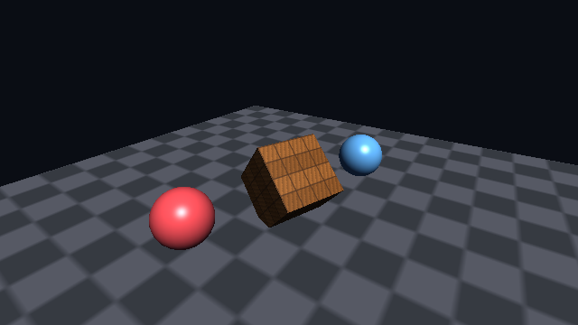

# runity

Игровой движок на Rust **без единой сторонней зависимости**. Весь код собирается
из `std` — ни `winit`, ни `wgpu`, ни `glam`, ни `image`, ни `libc`.

Основная платформа — **macOS** (AppKit через Objective-C runtime); X11 и Win32
уже работают, Wayland и мобильные — потом.

Рендерера здесь **два, и они проверяют друг друга**.

Софтварный растеризатор (`runity-render`) — это **эталон и второй свидетель**:
в нём конвейер записан словами, из него сделаны golden-эталоны, и он идёт на
машине без дисплея и без видеокарты. Он однопоточный и таким останется.

Metal-бэкенд (`runity-gpu`, только macOS) — это **то, как игра работает на
самом деле**: тот же кадр, собранный на железе, с презентом прямо в
`CAMetalLayer` окна.

Связывает их не доверие, а сравнение: `gpu::diff::assert_agrees` рисует одно и
то же замыкание дважды — растеризатором и офскрин-целью Metal — и держит кадры
друг против друга пиксель за пикселем. Шейдер, который есть только на одной
стороне, — не шейдер, который этот движок везёт.

```
$ cargo tree -p runity            # в дереве только крейты этого репозитория
runity v0.1.0
├── runity-core v0.1.0
│   ├── runity-gpu v0.1.0
│   │   ├── runity-math v0.1.0
│   │   └── runity-render v0.1.0
│   │       └── runity-math v0.1.0
│   ├── runity-math v0.1.0
│   ├── runity-platform v0.1.0
│   └── runity-render v0.1.0
├── runity-gpu v0.1.0
├── runity-math v0.1.0
├── runity-platform v0.1.0
└── runity-render v0.1.0
```



Кадр выше отрисован полностью на CPU и сохранён своим PNG-энкодером:
`RUNITY_HEADLESS=1 cargo run --release --example spinning_cube`.

## Что уже работает

| Слой | Крейт | Содержимое |
| --- | --- | --- |
| Математика | `runity-math` | `Vec2/3/4`, `Mat4` (колоночная, как в GLSL), `Quat`, проекции, `look_at`, инверсия матриц |
| Рендер | `runity-render` | программируемый софтварный растеризатор, буфер глубины, текстуры, меши, OBJ, debug-виды, golden-тесты, PNG (запись и чтение) + DEFLATE |
| GPU | `runity-gpu` | Metal через Objective-C runtime (только macOS): конвейер, презент в `CAMetalLayer`, офскрин-цель для тестов, MSL-близнецы шейдеров движка, differential-тесты против растеризатора |
| Платформа | `runity-platform` | окно и ввод: **macOS через Objective-C runtime**, X11 напрямую по wire-протоколу, Win32 через `user32`/`gdi32`, headless-бэкенд |
| Движок | `runity-core` | ECS на поколениях, время с фиксированным шагом, состояние ввода, главный цикл, headless-прогон и запись кадров |
| Фасад | `runity` | реэкспорт + `prelude`, примеры |

Конвейер растеризатора — тот же, что на GPU, только руками:

```
Mesh → Shader::vertex → отсечение по ближней плоскости → деление на w →
viewport → отсечение задних граней → растеризация (top-left rule) →
перспективно-корректная интерполяция → тест глубины → Shader::fragment → блендинг
```

## GPU: Metal

В окне на macOS движок по умолчанию идёт на Metal; headless по умолчанию —
растеризатор. Выбор переключается явно — `App::with_renderer(Renderer::Cpu)`
или переменной `RUNITY_RENDERER=cpu|gpu`. `RUNITY_RENDERER=cpu` работает как
ручной обход на любой платформе и в любой ситуации.

**Шейдер движка обязан иметь MSL-близнеца.** Четыре шейдера — `BasicShader`,
`UnlitShader`, `PulseShader`, `Gradient` — реализуют `GpuShader` поверх
обычного `Shader`, и MSL лежит рядом с Rust-версией (`shader.rs` →
`shader.metal`, `include_str!`). `Engine::draw` работает под обоими
рендерерами; `Engine::draw_cpu` принимает любой шейдер, но под `Renderer::Gpu`
паникует — у такого шейдера нет MSL-близнеца. В играх и примерах близнец по
желанию, у шейдеров самого движка — обязателен, и к каждому идёт парный
differential-тест.

**Граница 1× и 2×.** Differential-тесты всегда идут через офскрин-цель на 1×,
чтобы сравнивать два кадра ровно одного размера. Окно — другое дело: там
drawable равен `backingScaleFactor` окна, то есть 1920×1080 на ретине при
960×540 точек, и масштаб опрашивается каждый кадр, потому что окно могут
перетащить на другой монитор. Единственное намеренное расхождение между
рендерерами — отладочные линии: на GPU они рисуются отдельным line-pipeline
шириной 2 пикселя (на 2× это выглядит как на CPU) и в differential-тесты не
входят.

`DrawStats` на GPU честен ровно наполовину: `triangles_in` настоящий,
`fragments_shaded` и `fragments_written` — нули. Их считает растеризатор, когда
сам закрашивает пиксель; на железе такого счётчика нет, и выдумывать его
правдоподобное значение было бы хуже нуля.

Если Metal недоступен или MSL не скомпилировался, приложение не молчит:
причина — с текстом от компилятора Metal — уезжает в `stderr` и в `NSAlert`, и
процесс уходит с ненулевым кодом. На не-macOS GPU-бэкенда просто нет, и
`RUNITY_RENDERER=gpu` там — ошибка.

### Сколько это стоит

`RUNITY_BENCH=1 cargo run --release --example smallworld` прогоняет все семь
сцен на каждом рендерере и печатает мс/кадр (min/median/p95) в три колонки. На
Apple M5 Pro, 960×540 на 1× без vsync, 120 кадров на сцену:

```
scene                               CPU             GPU window          GPU offscreen
                         min/med/p95 ms         min/med/p95 ms         min/med/p95 ms
Lit scene               9.32/9.51/10.28         1.37/2.29/9.02         0.59/0.94/1.20
Triangle                1.36/2.18/11.68         1.90/2.24/8.58         0.30/0.40/0.46
Meshes                  2.38/3.07/11.74         1.86/2.26/8.99         0.46/0.52/0.54
Textures                 2.05/2.74/9.14         1.88/2.26/8.71         0.37/0.44/0.51
Depth & blending        1.59/2.31/11.80         1.84/2.24/8.84         0.30/0.40/0.46
World                   1.95/2.75/11.28         1.86/2.27/9.02         0.35/0.44/0.50
Teapots                 1.65/2.23/12.48         1.74/2.25/8.86         0.47/0.51/0.54
```

Медиана в колонке «GPU window» садится на 2.25 мс во всех семи сценах, хотя
сами сцены стоят по-разному: строка `on device` под ними — 0.04–0.16 мс. Это не
цена кадра, а цена ожидания — vsync в замере выключен, но `nextDrawable` всё
равно отдаёт кадр не быстрее, чем window server возвращает его в оборот. Цена
самой сцены видна в колонке «GPU offscreen», где ждать нечего.

Каждая сцена печатает ещё две строки: `on device` — это
`GPUEndTime - GPUStartTime`, собственный взгляд железа на кадр, и `read-back` —
во что обходится скачивание офскрин-кадра обратно в `Framebuffer`. Read-back не
зависит от сцены, только от числа пикселей: 0.03–0.05 мс на 960×540 и
0.11–0.13 мс на 1920×1080.

Седьмая сцена отвечает на вопрос «а сколько потянет». При 1920×1080 (пиксели
ретинового окна) и решётке, выросшей по `Space`, медиана кадра такая:

| чайников | треугольников | CPU | GPU в окне |
| --- | --- | --- | --- |
| 25 | 158 000 | 13.6 мс | 2.30 мс |
| 36 | 228 000 | 15.9 мс | 2.27 мс |
| 100 | 632 000 | 28.8 мс | 2.48 мс |
| 400 | 2 528 000 | 100.4 мс | 6.30 мс |
| 900 | 5 688 000 | 195.0 мс | 13.9 мс |
| 1600 | 10 112 000 | 304.9 мс | 24.6 мс |

Растеризатор перестаёт держать 60 fps примерно на 36 чайниках, Metal — примерно
на 900, и это при том, что меш заливается в буфер каждый кадр, без кэша
ресурсов. Воспроизводится это так:

```bash
RUNITY_BENCH=1 RUNITY_ACTIONS=29 RUNITY_BENCH_SIZE=1920x1080 \
  cargo run --release --example smallworld
```

## Отладка

Один переключатель — `engine.debug_view()` и `engine.set_debug_view(v)` —
меняет то, что показывает цикл, и код игры об этом ничего не знает:

| Вид | Что показывает | На GPU |
| --- | --- | --- |
| `Shaded` | сцену как есть | да |
| `Wireframe` | те же draw-вызовы, но только рёбра треугольников — через шейдер и с тестом глубины, а не линиями поверх кадра | **нет** |
| `Depth` | буфер глубины, нормированный по содержимому кадра | да, кадром позже |
| `Overdraw` | сколько раз переписан каждый пиксель | **нет** |

`Wireframe` и `Overdraw` — приёмы растеризатора, а не картинки, которые можно
собрать на железе тем же конвейером, так что на GPU они честно отказывают:
`set_debug_view` возвращает `Err(UnsupportedView)`, вид не переключается, а
причина уезжает в заголовок окна на две секунды — потом возвращается обычный
заголовок с fps. `Depth` работает: depth-текстура скачивается, нормируется тем
же кодом, что и на CPU, и возвращается блитом — отсюда кадр задержки. Стоит он
дорого: скачать буфер глубины ретинового окна, нормировать его на CPU и залить
обратно — это примерно 23 fps там, где `Shaded` идёт 120. Это цена отладочного
вида, а не кадра игры.

Поверх кадра можно дорисовать `engine.draw_normals(...)`, `engine.draw_axes(...)`
и `engine.draw_wireframe(...)`.

В примере это клавиши 1–4 и N, а headless — переменная
`RUNITY_DEBUG_VIEW=wireframe|depth|overdraw`.

## Headless-разработка

Кадр можно получить без окна, цикла и дисплея:

```rust
let frame = headless::render(320, 240, |engine| {
    let shader = engine.lit_shader(Mat4::IDENTITY);
    engine.draw(&Mesh::cube(1.0), &shader);
});
save_png("frame.png", &frame)?;
```

Для анимации есть `headless::run` (N кадров с фиксированным шагом — прогон
детерминирован) и `headless::record` (то же, но с сохранением каждого кадра,
`headless::save_frames` разложит их по PNG).

Регрессии ловятся сравнением с эталоном:

```rust
golden::assert_matches("tests/golden/scene.png", &frame, Tolerance::new(4, 0.02));
```

Эталона нет — он создастся при первом запуске. Разошлось — рядом лягут
`scene.actual.png` и `scene.diff.png` с подсвеченной разницей, а в тексте
падения будет, сколько пикселей и насколько разъехались. Изменение осознанное —
`RUNITY_UPDATE_GOLDEN=1 cargo test`, и в ревью видно ровно то, что поменялось на
экране.

Чтобы прочитать эталон, нужен полноценный распаковщик: `runity-render` умеет
DEFLATE (stored, fixed и dynamic Huffman) и читает 8-битные PNG — greyscale,
RGB, палитру и варианты с альфой, со всеми пятью фильтрами строк.

## Запуск

```bash
cargo run --release --example smallworld         # витрина: семь сцен в одном окне
cargo run --release --example spinning_cube      # окно: macOS, X11 или Win32
cargo run --release --example hello_triangle

RUNITY_RENDERER=cpu cargo run --release --example smallworld    # то же, но растеризатором

RUNITY_HEADLESS=1 cargo run --release --example smallworld      # семь PNG: 01-lit-scene … 07-teapots
RUNITY_HEADLESS=1 cargo run --release --example spinning_cube   # без дисплея, пишет cube.png
cargo test --workspace                                          # тесты, дисплей не нужен

# кросс-проверка бэкендов, которые нельзя собрать на текущей машине
cargo check --workspace --target aarch64-apple-darwin
cargo check --workspace --target x86_64-apple-darwin
cargo check --workspace --target x86_64-pc-windows-gnu
```

Управление в `spinning_cube`: стрелки или WASD — орбита камеры, Q/E — зум,
Escape — выход.

`smallworld` — семь сцен (Lit scene, Triangle, Meshes, Textures, Depth &
blending, World, Teapots) в одном окне 960×540: Tab и Shift+Tab листают их по
кругу, стрелки или WASD крутят камеру текущей сцены, Q/E — зум, пробел —
действие сцены (в World — ещё десять сущностей, в Teapots — ещё ряд решётки),
Backspace — обратное (в World — снять последние десять, в Teapots — убрать
ряд), 1–4 и N — отладочные виды, Escape — выход. Каждая сцена помнит свою
камеру и замирает, пока не на экране; отладочный вид общий и переживает
переключение. `RUNITY_SCENE=1..7` открывает нужную сцену сразу,
`RUNITY_HEADLESS=1` прогоняет все семь по 60 кадров с шагом 1/60 и раскладывает
их по PNG. Полный список клавиш и переменных — в док-комментарии
`crates/runity/examples/smallworld.rs`.

| PNG | Сцена |
| --- | --- |
| `01-lit-scene.png` | Lit scene |
| `02-triangle.png` | Triangle |
| `03-meshes.png` | Meshes |
| `04-textures.png` | Textures |
| `05-depth-blending.png` | Depth & blending |
| `06-world.png` | World |
| `07-teapots.png` | Teapots |

`tools/package-macos.sh` собирает `smallworld` в `dist/SmallWorld.app` —
приложение, которое открывается двойным кликом из Finder, без терминала и
переменных окружения. Бандл идёт на GPU: у двойного щелчка нет переменных
окружения, а окно по умолчанию и так Metal. Скрипт заодно компилирует
`shader.metal` через `xcrun metal` и кладёт `default.metallib` в
`Contents/Resources` — рантайм сначала пробует `newLibraryWithSource:`, и
только если тулчейна на машине нет, грузит `.metallib` из бандла. Исходник MSL
в репозитории — единственная правда; собранный `.metallib` не коммитится.
Бандл подписан ad-hoc, чтобы Gatekeeper не ругался на локальной машине.
Управление то же, что и у примера: Tab / Shift+Tab — сцены по кругу, стрелки
или WASD — камера, Q/E — зум, 1–4 и N — отладочные виды, пробел — действие
сцены, Backspace — отменить его, Escape — выход. Headless-PNG бандл не пишет —
для них нужен `cargo run` с `RUNITY_HEADLESS=1`, как выше.

## Свой шейдер

Шейдер — это просто пара функций; растеризатор интерполирует всё, что вернёт
вершинная стадия:

```rust
struct Gradient { mvp: Mat4 }

impl Shader for Gradient {
    type Varying = Color;

    fn vertex(&self, v: &Vertex) -> VertexOutput<Color> {
        VertexOutput { clip_position: self.mvp.transform_point(v.position), varying: v.color }
    }

    fn fragment(&self, color: &Color) -> Option<Color> {
        Some(*color)          // None = discard
    }
}
```

## Правила по зависимостям

1. В `Cargo.toml` любого крейта разрешены только пути на соседние крейты
   воркспейса. Внешних зависимостей нет — включая dev-зависимости.
2. `unsafe` запрещён везде (`#![forbid(unsafe_code)]`), кроме трёх очагов, где
   без FFI не обойтись: Win32-бэкенд (`user32`/`gdi32`), macOS-бэкенд
   (Objective-C runtime) и `runity-gpu` (тот же runtime плюс Metal). Каждый
   `unsafe`-блок сопровождается комментарием об инвариантах. `runity-render`
   остаётся `#![forbid(unsafe_code)]` целиком, и `runity-gpu` берёт из него
   только типы данных — `Mesh`, `Vertex`, `Color`, `Texture`, `Framebuffer`,
   `Blend`, `CullMode`.
3. Всё, что нельзя проверить на машине без дисплея, должно быть проверяемо
   иначе: X11-бэкенд тестируется против поддельного X-сервера
   (`crates/runity-platform/tests/x11_wire.rs`), рендер — сравнением с
   независимо посчитанным пересечением луча с плоскостью
   (`crates/runity-render/tests/pipeline.rs`), а разбор событий Cocoa вынесен
   в модуль без единого вызова Objective-C, чтобы его тесты шли на любой
   машине (`crates/runity-platform/src/macos_keys.rs`).
4. Тесты, которым нужно железо, пропускаются громко, а не тихо:
   differential-тесты `runity-gpu` на машине без Metal печатают, что именно
   они не проверили, и `cargo test --workspace` остаётся зелёным.
   `RUNITY_REQUIRE_GPU=1` превращает такой пропуск в падение — это то, что
   должна ставить машина, у которой GPU есть.

Подробности о том, как вообще рисовать без зависимостей, — в
[docs/ARCHITECTURE.md](docs/ARCHITECTURE.md).

## Чего ещё нет

Сейчас это твёрдая основа, а не законченный движок. Ближайшее по списку:
кэш GPU-ресурсов (`Handle<GpuMesh>` — сейчас меш заливается в буфер каждый
кадр), mip-mapping, отсечение по frustum, иерархия трансформов, текстовый
оверлей для статистики прямо в кадре, загрузка glTF. Из визуального на GPU нет
ни теней, ни тонмаппинга, ни гамма-коррекции, ни MSAA — ровно потому, что
каждое из этого сначала должно появиться на обеих сторонах сразу.

Чего в списке нет и не будет: многопоточной и SIMD-растеризации. Растеризатор
нужен как эталон и как свидетель, однопоточный проход проще читать, и он
детерминирован — а на детерминизме держатся и golden-тесты, и differential-тесты
против Metal. Быстро — это работа GPU-пути.

## Лицензия

MIT OR Apache-2.0.
