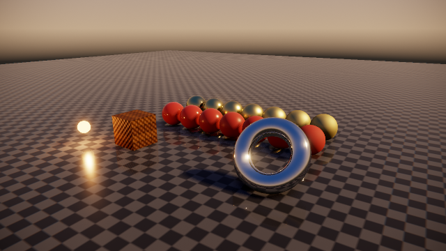
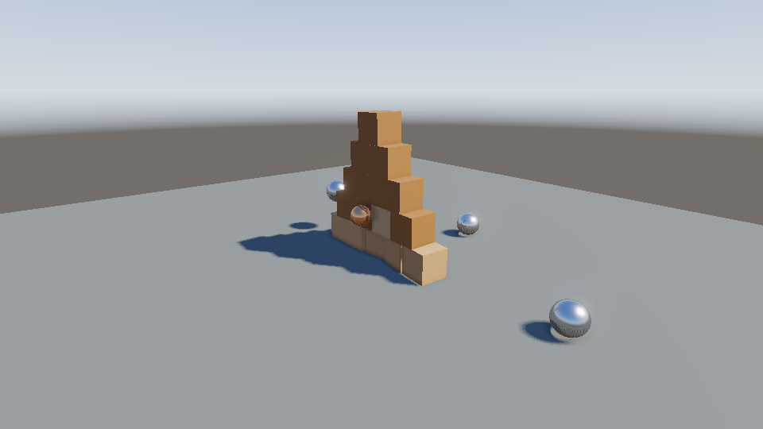
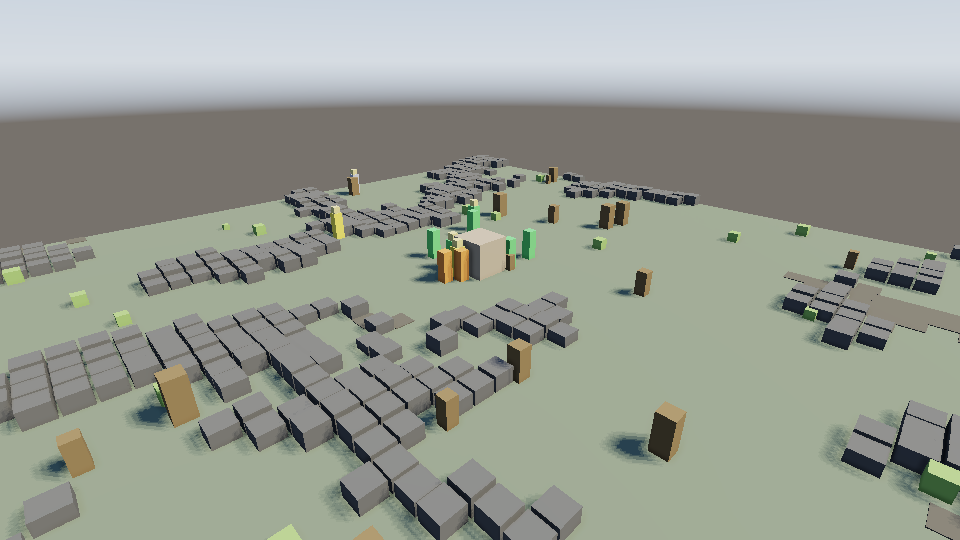

# runity

Игровой движок на Rust **без единой сторонней зависимости**. Весь код собирается
из `std` — ни `winit`, ни `wgpu`, ни `glam`, ни `image`, ни `libc`.

Основная платформа — **macOS** (AppKit через Objective-C runtime); X11 и Win32
уже работают, Wayland и мобильные — потом.

Рендерер здесь — инструмент **отладки и headless-разработки**, а не способ
выжать кадры в секунду: он однопоточный и таким останется. Взамен он считает
физически корректный свет — PBR, IBL, тени, SSAO, отражения, bloom — и всё, что
рисуется, можно посмотреть послойно и проверить пиксель в пиксель без дисплея.

```
$ cargo tree -p runity            # в дереве только крейты этого репозитория
runity v0.1.0
├── runity-ai v0.1.0
│   ├── runity-math v0.1.0
│   └── runity-serialize v0.1.0
├── runity-core v0.1.0
│   ├── runity-math v0.1.0
│   ├── runity-physics v0.1.0
│   ├── runity-platform v0.1.0
│   ├── runity-render v0.1.0
│   └── runity-serialize v0.1.0
├── runity-math v0.1.0
├── runity-physics v0.1.0
├── runity-platform v0.1.0
├── runity-render v0.1.0
└── runity-serialize v0.1.0
```



Кадр выше посчитан полностью на CPU, в один поток, и сохранён своим
PNG-энкодером: `RUNITY_HEADLESS=1 RUNITY_SUPERSAMPLE=2 cargo run --release
--example showcase`. Шары — шкала шероховатости: металл сзади, диэлектрик
спереди, слева зеркало, справа матовое.

## Что уже работает

| Слой | Крейт | Содержимое |
| --- | --- | --- |
| Математика | `runity-math` | `Vec2/3/4`, `Mat3/4` (колоночные, как в GLSL), `Quat`, проекции, `look_at`, инверсия матриц, PCG32 с именованными потоками, шумы (value, Perlin, Worley, fbm, ridged, domain warping) |
| Рендер | `runity-render` | отложенный растеризатор с PBR, IBL, тенями, SSAO, SSR, bloom и оптикой; мип-маппинг, debug-виды, golden-тесты, PNG (запись и чтение) + DEFLATE |
| Платформа | `runity-platform` | окно и ввод: **macOS через Objective-C runtime**, X11 напрямую по wire-протоколу, Win32 через `user32`/`gdi32`, headless-бэкенд |
| Физика | `runity-physics` | твёрдые тела, sweep and prune, точные контакты (включая SAT для коробок), последовательные импульсы с warm starting, сон, лучи, события контактов |
| ИИ | `runity-ai` | пространственный хеш-грид, навигационная сетка, A* на целочисленных стоимостях, flow-поля, стиринг, восприятие, utility-решения |
| Сохранения и сеть | `runity-serialize` | версионированный бинарный формат: varint'ы, CRC32, заголовок с видом и версией, детерминированные байты, ни одной паники на битом вводе |
| Движок | `runity-core` | ECS на поколениях с запросами, событиями и отслеживанием изменений; часы мира отдельно от кадра; время с фиксированным шагом, ввод, главный цикл, headless-прогон и запись кадров |
| Фасад | `runity` | реэкспорт + `prelude`, примеры |

Конвейер — тот же, что в GPU, только на CPU и в один поток:

```
геометрия  Mesh → vertex → отсечение по ближней плоскости → /w → viewport →
           отсечение задних граней → растеризация (top-left rule) →
           перспективно-корректная интерполяция → тест глубины → G-buffer
свет       SSAO → PBR (GGX + Smith + Шлик) с тенями и IBL → небо
экран      SSR → bloom → вигнетка/зерно/аберрации → суперсэмплинг →
           экспозиция → ACES → sRGB
```

Всё внутри — линейный HDR без верхней границы; в 8 бит кадр превращается ровно
один раз, в самом конце.

## Симуляция мира

Рендерер отвечает на вопрос «как это выглядит», а всё остальное — на вопрос
«что вообще происходит». Мир должен развиваться сам, одинаково на любой машине
и после перезагрузки сохранения, поэтому в основе лежат четыре вещи.

**Часы мира отдельно от кадра.** `Time` меряет кадры, `WorldClock` — тики
симуляции: целые, с календарём и сезонами, с паузой и скоростями ×1…×8,
с ограничением на догон после лага и с досчётом пропущенного времени пачкой.
Машина, которая рисует 30 кадров в секунду, и машина, которая рисует 144,
проживают одинаковое количество тиков.

**Детерминированная случайность.** `Rng` — PCG32 с именованными потоками:
`Rng::named(seed, "combat")` и `Rng::named(seed, "terrain")` независимы, и
лишний бросок кубика в бою не сдвигает генерацию ландшафта. Шумы хешируют
координаты, а не тасуют таблицу, поэтому чанк 700 можно сгенерировать раньше
чанка 3 и получить тот же результат.

**ECS с запросами, событиями и отслеживанием изменений.** Запрос по нескольким
компонентам (`query2`, `query_without`, `each2_mut`), события с двойной
буферизацией — каждое читается ровно один тик независимо от порядка систем, —
и `changed_since(tick)`, который выдаёт ровно то, чего вторая сторона ещё
не знает. Это и есть готовая дельта для сети.

**Один бинарный формат на сохранения, сеть и тесты.** Байты детерминированы
(little-endian, float'ы битами, словари в отсортированном порядке), поэтому
сравнение двух снапшотов — это `==` на срезе, а формат сохранения проверяется
тысячами прогонов тестов, а не раз в релиз.

```
$ cargo run --release --example settlement
A valley, seed 20260918. Nobody is in charge.

  year  1 spring  people   5  houses  0  granaries 0  wood   40.0  food   60.0
  year  2 spring  people  34  houses 10  granaries 4  wood  287.6  food 2330.0
     36 born (Mirena last), 3 lost (Velomir last), 10 house(s), 4 granary(ies)
  ...
saved 12039 bytes
  a year later, both agree: year 14 spring  people 271  houses 94 ...
```

Деревня в примере растёт сама: жители собирают еду и лес, меняют профессию
под нужды поселения, строят дома и амбары, зимой голодают, если не запасли.
Пример заканчивается тремя проверками — сохранение переживает свой же
round-trip, загруженный мир проживает следующий год точно так же, как исходный,
и один и тот же seed всегда даёт одну и ту же историю.

## Физика



`PhysicsWorld` делает шаг в фиксированном порядке: интегрирование скоростей →
sweep and prune → точные контакты → пробуждение спящих тел → импульсы с warm
starting → отдельный позиционный проход, чья скорость снимается сразу после
интегрирования → сон. Порядок фиксирован, списки отсортированы — две машины
получают одинаковые позиции до бита.

Контакты приходят событиями (`Started`/`Ended`), а не опросом, так что удар,
который начался и кончился внутри одного шага, всё равно виден. Пара, исчезнувшая
только потому, что оба тела уснули, событием не считается.

```
cargo run --release --example physics_playground   # пробел — выстрелить шаром
```

## ИИ и навигация



Деревня на картинке никем не управляется. Камни и топи взяты из шума, из того
же шума посчитана навигационная сетка — то, по чему ходит ИИ, и то, что видно
на экране, не могут разойтись. Жители не следуют скрипту: каждый вариант
(«идти за едой», «идти за деревом», «нести добычу домой») набирает очки от
состояния мира, и побеждает лучший.

**Пространственные запросы.** `SpatialGrid` отвечает на «что рядом» за
примерно постоянное время и перестраивается целиком каждый тик — в симуляции
почти всё движется, и устаревшая ячейка дороже перестройки. Тест проверяет
главное свойство: грид может быть щедрым, но не имеет права что-то пропустить.

**Поиск пути в целых числах.** Не ради скорости, а ради порядка: у очереди с
приоритетом на `f32` нет полного порядка, и две машины, разбирающие ничьи
по-разному, находят разные маршруты по одному и тому же полю. У A* есть бюджет
(без него маршрут в отрезанный угол карты обходит весь мир — внутри тика, на
каждый запрос), он не срезает заблокированные углы и вытягивает лестницу в
маршрут. Оптимальность проверяется не собой, а независимым полным перебором
на случайных картах.

**Flow-поля** отвечают на ту же задачу с другой стороны: когда двести жителей
идут к одному амбару, одна заливка заменяет двести поисков.

**Стиринг** — это то, что отличает агента от интерполятора: `arrive`
тормозит перед целью, `separation` сильнее всего реагирует на ближайшего
соседа, поэтому очередь у склада расходится, а не дёргается. Агенты, стоящие
ровно друг в друге, расходятся вдоль фиксированной оси — в общем мире монетку
бросать нельзя.

**Восприятие отдельно от решений.** Агент, который оценивает варианты по
истинному состоянию мира, всеведущ, и игрок это замечает сразу. `Senses` даёт
конус зрения, затухающий к краю, слух, который не зависит от направления
взгляда, и `Awareness`, которая накапливается: часовой сначала косится, потом
настораживается, и только потом реагирует.

**Решения — очки, а не дерево поведения.** Дерево задаёт порядок решений, а у
жителя порядок меняется от сезона, голода и того, гонится ли за ним кто-то.
Очки задают причины: новое действие — это одна функция, а не переписывание
ветки. Соображения перемножаются (одно невыполнимое требование должно всё
отменять) с компенсацией, без которой больше трёх соображений использовать
невозможно.

```
cargo run --release --example foragers   # P — пауза мира
```

## Отладка

Один переключатель `engine.debug_view` меняет то, что показывает цикл, — код
игры об этом ничего не знает:

| Вид | Что показывает |
| --- | --- |
| `Shaded` | сцену как есть |
| `Wireframe` | те же draw-вызовы, но только рёбра треугольников — через шейдер и с тестом глубины, а не линиями поверх кадра |
| `Depth` | буфер глубины, нормированный по содержимому кадра |
| `Overdraw` | сколько раз переписан каждый пиксель |
| `Albedo` | цвет поверхности до освещения |
| `Normals` | нормали в мировом пространстве |
| `Material` | шероховатость в зелёном, металличность в синем |
| `Occlusion` | результат SSAO отдельно от всего остального |

Поверх кадра можно дорисовать `engine.draw_normals(...)`, `engine.draw_axes(...)`
и `engine.draw_wireframe(...)`.

В примерах это клавиши 1–8, а headless — переменная
`RUNITY_DEBUG_VIEW=wireframe|depth|overdraw|albedo|normals|material|occlusion`.
В `showcase` клавиши F1–F5 включают и выключают SSAO, отражения, bloom, оптику
и тени по отдельности — чтобы видеть, что именно каждый эффект даёт.

## Headless-разработка

Кадр можно получить без окна, цикла и дисплея:

```rust
let frame = headless::render(320, 240, |engine| {
    let shader = engine.lit_shader(Mat4::IDENTITY);
    engine.draw(&Mesh::cube(1.0), &shader);
});
save_png("frame.png", &frame)?;
```

Для анимации есть `headless::run` (N кадров с фиксированным шагом — прогон
детерминирован) и `headless::record` (то же, но с сохранением каждого кадра,
`headless::save_frames` разложит их по PNG).

Регрессии ловятся сравнением с эталоном:

```rust
golden::assert_matches("tests/golden/scene.png", &frame, Tolerance::new(4, 0.02));
```

Эталона нет — он создастся при первом запуске. Разошлось — рядом лягут
`scene.actual.png` и `scene.diff.png` с подсвеченной разницей, а в тексте
падения будет, сколько пикселей и насколько разъехались. Изменение осознанное —
`RUNITY_UPDATE_GOLDEN=1 cargo test`, и в ревью видно ровно то, что поменялось на
экране.

Чтобы прочитать эталон, нужен полноценный распаковщик: `runity-render` умеет
DEFLATE (stored, fixed и dynamic Huffman) и читает 8-битные PNG — greyscale,
RGB, палитру и варианты с альфой, со всеми пятью фильтрами строк.

## Запуск

```bash
cargo run --release --example showcase           # окно: macOS, X11 или Win32
cargo run --release --example spinning_cube
cargo run --release --example hello_triangle

RUNITY_HEADLESS=1 cargo run --release --example showcase         # без дисплея, пишет showcase.png
RUNITY_HEADLESS=1 RUNITY_SUPERSAMPLE=2 cargo run --release --example showcase
cargo run --release --example bench                             # сколько стоит каждый проход
cargo test --workspace                                          # 218 тестов, дисплей не нужен

# кросс-проверка бэкендов, которые нельзя собрать на текущей машине
cargo check --workspace --target aarch64-apple-darwin
cargo check --workspace --target x86_64-apple-darwin
cargo check --workspace --target x86_64-pc-windows-gnu
```

Управление в `spinning_cube`: стрелки или WASD — орбита камеры, Q/E — зум,
Escape — выход.

## Как это выглядит в коде

Обычный рендер — это материал и матрица:

```rust
engine.draw_pbr(
    &mesh,
    Mat4::from_translation(position),
    &Material::metal(Color::rgb(0.95, 0.78, 0.42), 0.15),
);
```

Материал — metal/roughness плюс карты (albedo, normal, metallic-roughness,
emissive), свет — направленный, точечный или конусный, окружение —
процедурное небо, из которого получаются и фон, и отражения, и рассеянный
свет, и солнце как источник:

```rust
engine.renderer.set_sky(Sky::new(SkyParams::golden_hour()));
engine.renderer.lights.push(Light::point(position, Color::rgb(1.0, 0.45, 0.18), 9.0, 7.0));
```

А если нужен свой шейдер — это по-прежнему просто пара функций, и растеризатор
интерполирует всё, что вернёт вершинная стадия:

```rust
struct Gradient { mvp: Mat4 }

impl Shader for Gradient {
    type Varying = Color;

    fn vertex(&self, v: &Vertex) -> VertexOutput<Color> {
        VertexOutput { clip_position: self.mvp.transform_point(v.position), varying: v.color }
    }

    fn fragment(&self, color: &Color) -> Option<Color> {
        Some(*color)          // None = discard
    }
}
```

## Правила по зависимостям

1. В `Cargo.toml` любого крейта разрешены только пути на соседние крейты
   воркспейса. Внешних зависимостей нет — включая dev-зависимости.
2. `unsafe` запрещён везде (`#![forbid(unsafe_code)]`), кроме двух
   платформенных бэкендов — macOS (Objective-C runtime) и Win32: там без FFI
   не обойтись, и каждый `unsafe`-блок сопровождается комментарием об
   инвариантах.
3. Всё, что нельзя проверить на машине без дисплея, должно быть проверяемо
   иначе: X11-бэкенд тестируется против поддельного X-сервера
   (`crates/runity-platform/tests/x11_wire.rs`), рендер — сравнением с
   независимо посчитанным пересечением луча с плоскостью
   (`crates/runity-render/tests/pipeline.rs`), а разбор событий Cocoa вынесен
   в модуль без единого вызова Objective-C, чтобы его тесты шли на любой
   машине (`crates/runity-platform/src/macos_keys.rs`).

Подробности о том, как вообще рисовать без зависимостей, — в
[docs/ARCHITECTURE.md](docs/ARCHITECTURE.md).

## Сколько это стоит

Один поток, кадр 640×360 со сценой уровня `showcase` (числа с машины, где это
писалось; `cargo run --release --example bench` посчитает для вашей):

| Что включено | Секунд на кадр |
| --- | --- |
| всё | 0.50 |
| без SSAO | 0.34 |
| без SSR | 0.38 |
| только геометрия и свет | 0.19 |
| всё, 2× суперсэмплинг | 2.41 |

Дороже всего SSAO и SSR, тени почти бесплатны. Для интерактивной работы эффекты
выключаются по одному; для стилла включается всё и добавляется суперсэмплинг.

## Чего ещё нет

Сейчас это твёрдая основа, а не законченный движок. Ближайшее по списку:
сеть (дельты у `changed_since` уже есть, транспорта и разрешения конфликтов
нет), уровни детализации симуляции — агенты вдали должны считаться агрегатом,
динамическое перестроение навигационной сетки по мере застройки, иерархия
трансформов и отсечение по frustum, загрузка glTF, текстовый оверлей со
статистикой прямо в кадре, HiDPI на macOS, сжимающий PNG-энкодер.

Чего в списке нет и не будет: многопоточной и SIMD-растеризации. Рендерер нужен
для отладки и headless-прогона, а однопоточный проход проще читать, и он
детерминирован — а на детерминизме держатся golden-тесты.

## Лицензия

MIT OR Apache-2.0.
